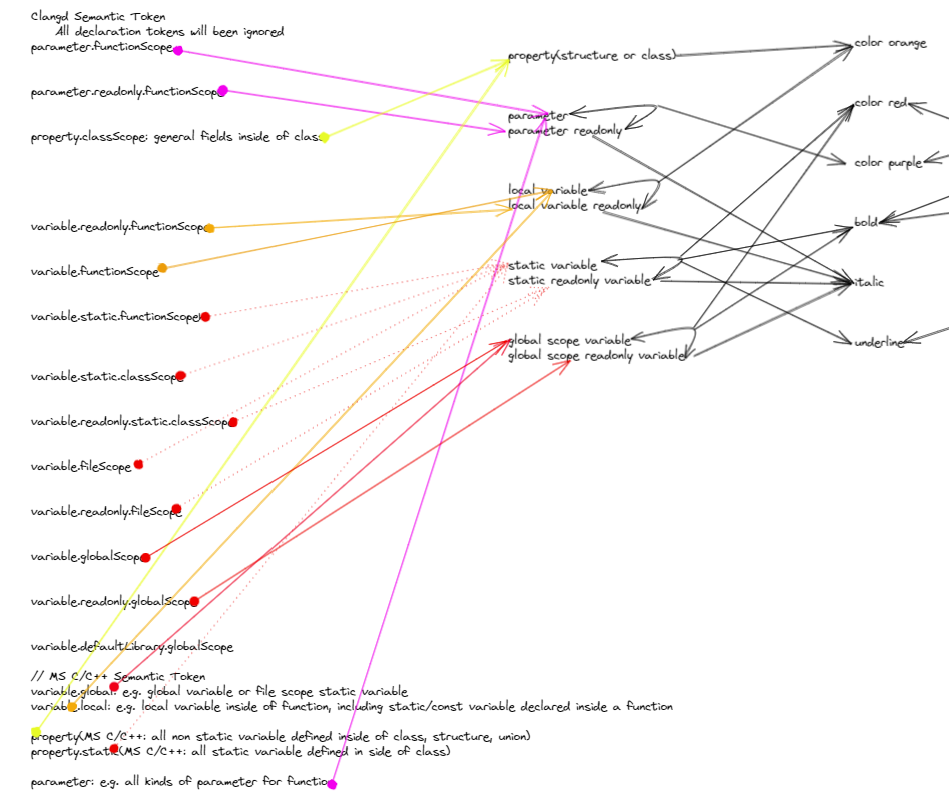
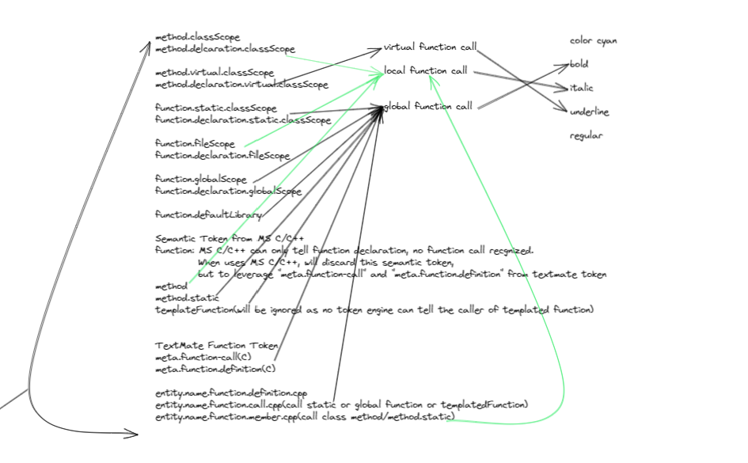
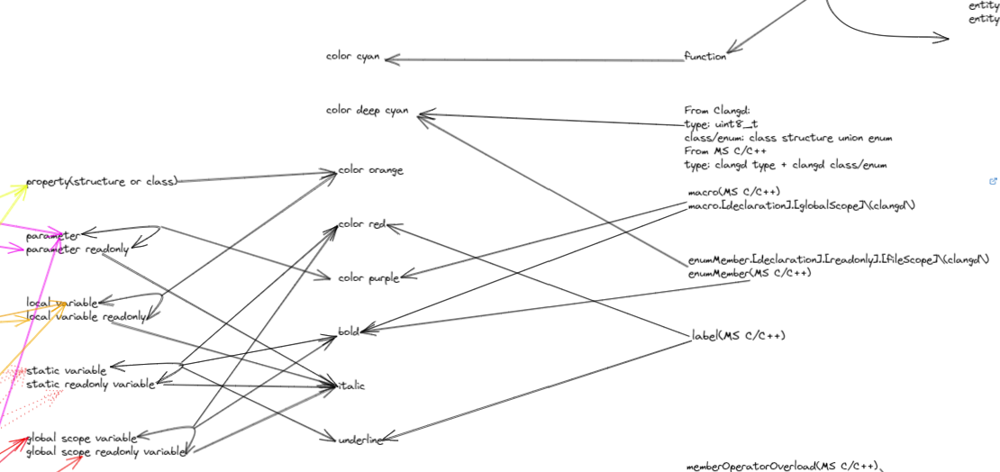
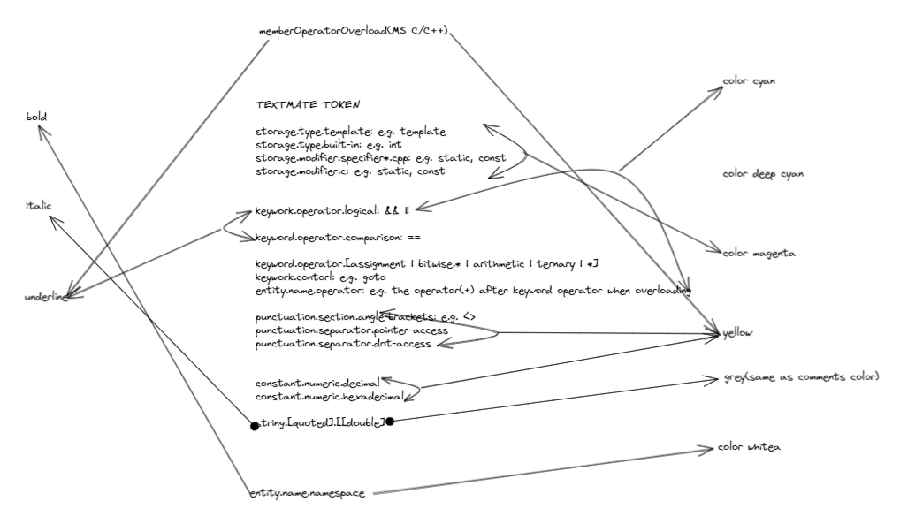
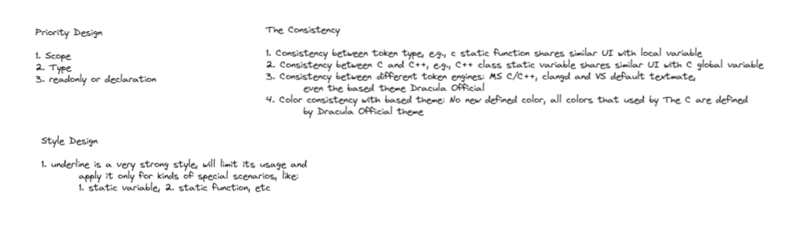

# README

On VS Code, you deserve a better color theme to C/C++ language.

With the semantic tokens supplied by MS C/C++ extension or clangd extension, VS code theme could recognize more syntax tokens for C/C++. MS did officially provide some specific themes to support the semantic tokens, but they all can't release the real power of semantic token. **C/C++ Theme** could give you more.

C/C++ Theme could recognize below tokens and provide a systematic, consistent and peaceable visual experience.

> Variable design

> Function design

> Type Design

> Misc Deisgn

> The Design Principle

## Development

> Token format

`(*|tokenType)(.tokenModifier)*(:tokenLanguage)?`

> References

- [The Semantic Highlight Guide from VSCode](https://code.visualstudio.com/api/language-extensions/semantic-highlight-guide)