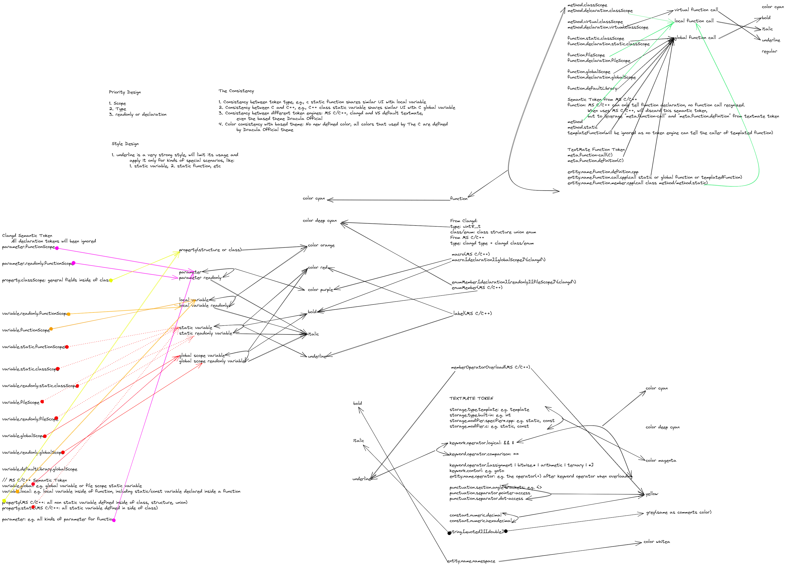

# README

On VS Code, you deserve a better color theme for C/C++ language.

With the semantic tokens supplied by MS C/C++ extension or clangd extension, VS code theme could recognize more syntax tokens for C/C++. However, so for no theme can release the real power of semantic token. Now **C/C++ Theme** try to give you more.

C/C++ Theme could recognize below tokens and provide a systematic, consistent and peaceable visual experience.

In short, it could highlight below tokens(below tokens are after aggregation):

> Variables

1. property
2. parameter
3. paramter readonly
4. local variable
5. local variable readonly
6. static variable
7. global variable
8. global variable readonly

> Functions

1. virtual function
2. local function
3. global function

And:

1. type/class/structure/union/enum
2. macro
3. enum member
4. label
5. modifiers, keywords, punctuations, etc.

Beside of recognizing of so much tokens, C/C++ Theme tries to have some underlying logic to offer a better final result. It has these built-in principles to achieve the goal:

1. Priority Design
   1. Scope has highest priority
   2. Then type
   3. Then readonly, or declaration, or other attributions
2. Consistency Design
   1. Consistency between similar concepts, e.g., static variable shares similar UI with global variable
   2. Consistency between C and C++
   3. Consistency between MS C/C++ and clangd. **C/C++ Theme** leverages the two LSP to get semantic tokens, they generates different semantic token set and names, **C/C++ Theme** aggregate them into a uniform rendering.
   4. Consistency with the based theme [Dracula Official](https://github.com/dracula/visual-studio-code.git). All the colors **C/C++ Theme** used are from the based theme.
3. Style Design
   1. `underline` is a very strong style, it was limited for kind of special tokens. e.g. static variable or static functions.

## Development

To contribute or modify the theme, please refer to [Here](./Develop.md).

