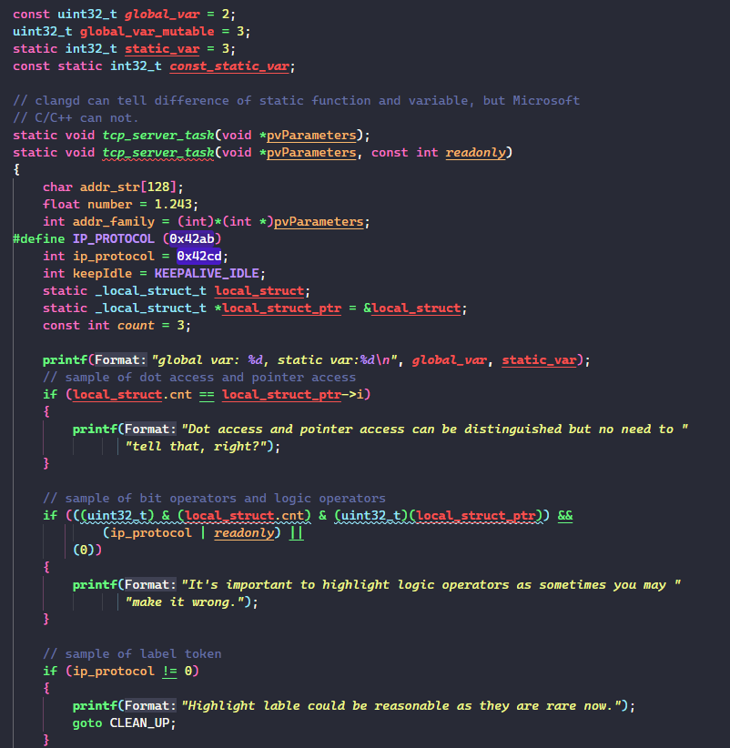

# README

On VS Code, you deserve a better color theme for C/C++ language.

With the power of semantic tokens provided by MS C/C++ extension or clangd extension, VS code could recognize more syntax tokens for C/C++. 

However, so for no theme releases the real power of this, **C/C++ Theme** tries to change this and offer you an amazing C/C++ program experience on VS Code.

**C/C++ Theme** could recognize plenty of tokens and provide a systematic, consistent and non distractive visual experience. Below are some samples.

> **C/C++ Theme** with MS C/C++ extension

> **C/C++ Theme** with clangd extension

**C/C++ Theme** could recognize much more tokens than other basic themes, and it supports both MS C/C++ extension and clangd extension, and provides a similar rendering result.

You may notice that the two rendering result is a little different, this is because the two extensions recognize different tokens. If you want to know the exact tokens **C/C++ Theme** could support, please refer to below image:

In short, it could highlight below tokens(below tokens are after raw token aggregating):

> Variables

1. property
2. parameter
3. paramter readonly
4. local variable
5. local variable readonly
6. static variable
7. global variable
8. global variable readonly

> Functions

1. virtual function
2. local function
3. global function

And:

1. type/class/structure/union/enum
2. macro
3. enum member
4. label
5. modifiers, keywords, punctuations, etc.

Beside of recognizing of so much tokens, **C/C++ Theme** tries to have some underlying design logic to offer the best rendering result. It has these built-in principles to achieve the goal:

1. Priority Design
   1. Scope has highest priority
   2. Then type
   3. Then readonly, or declaration, or other attributions
2. Consistency Design
   1. Consistency between similar concepts, e.g., static variable shares similar UI with global variable
   2. Consistency between C and C++
   3. Consistency between MS C/C++ and clangd. **C/C++ Theme** leverages the two LSP to get semantic tokens, they generates different semantic token set and names, **C/C++ Theme** aggregate them into a uniform rendering.
   4. Consistency with the based theme [Dracula Official](https://github.com/dracula/visual-studio-code.git). All the colors **C/C++ Theme** used are from the based theme.
3. Style Design
   1. `underline` is a very strong style, it was limited for kind of special tokens. e.g. static variable or static functions.

## Q&A

1. The support of C++.
    > I don't use much of C++, so there's only basic support to C++(maybe already enough). If you have better idea to render C++ tokens, welcome to contribute(PR or issue).

2. Why parameter uses `underline` style?
    > The first version of parameter is using the purple color to distinguish it from local variable, but I find this design is too strong and distractive. Then I tried to use some other color, no suitable color could find. The orange seems to be the only acceptable color. Imo, the differentiation between parameter and local variable is necessary, so `underline` style is added to it.

3. Differentiation between MS C++ extension and clangd extension.
    > Both are the top end C/C++ LSP, in summary, clangd offers more precise token types than MS C++, especially to `variable` and `function` types, and it's fast. But MS C/C++ extension offers a more appropriate token set and better compatibility(only my personal experience based on daily usage).

## Development

To contribute or modify the theme, please refer to [Here](./Develop.md).
 